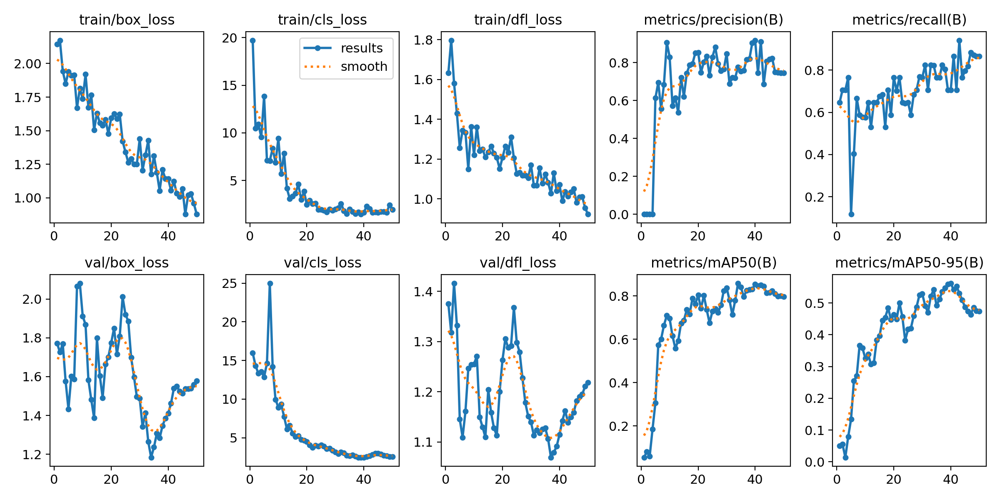

# AI-Powered Surface Inspection System 🏭🧠 (Cross-Version Integration)

*(**Note:** This project serves as a PLC-Python AI bridge designed to work in integration with the AI-Powered Fabric Defect Marking System and Industrial CANbus Data Analyzer projects.)*

This project is an Artificial Intelligence (AI) based control system that detects defective products/surface anomalies on the production line and sends real-time signals to a SIEMENS PLC (S7-1200 / S7-1500) using the Snap7 library.

**Update (v2.0):** The previous color-based (OpenCV HSV Thresholding) Proof-of-Concept algorithm has been completely replaced with a **YOLOv8** object detection model trained on the MVTec AD dataset, meeting real-world industrial standards.

## 🌟 Project Summary
- **Webcam / Video Stream:** Provides real-time video feed from the production line.
- **YOLOv8 AI Analysis:** Detects flaws and anomalies on industrial surfaces.
- **PLC Communication:** Python automatically writes Data Blocks (DB) to the PLC via Snap7. (Sends `2` if a defect is found, `1` if the surface is OK.)
- **Real-Time Decision:** Automatically triggers the connected PLC automation system to stop the line when a defect is detected.

---

## 🚀 Installation & Usage

### 1. Install Requirements
Install the core libraries required to run the project:
```bash
pip install python-snap7 opencv-python ultralytics
```

### 2. Prepare MVTec Dataset for YOLOv8 Model (NEW!)
To operate properly, the YOLOv8 model must be trained using the MVTec AD dataset.

1. **Download Dataset:** Download a specific category (e.g., `leather`, `wood`, `metal_nut`) from the [MVTec AD Dataset](https://www.mvtec.com/company/research/datasets/mvtec-ad).
2. **Extract Archive:** Extract the Zip/Tar file into the `mvtec_anomaly_detection/` folder in the project's root directory. (e.g., directory structure should be `mvtec_anomaly_detection/leather/train` and `test`).
3. **Convert to YOLO Format:** Run the following command in your terminal to convert the dataset masks into YOLO Bounding Box format:
```bash
python src/prepare_mvtec.py --category leather
```
*(This process will generate a `datasets/mvtec_leather_yolo` folder and a `mvtec_leather_data.yaml` config file.)*

### 3. Training the YOLOv8 Model
To train the model dynamically on your local machine:
```bash
python src/train_yolov8.py --data ./mvtec_leather_data.yaml --epochs 50
```
*(Training duration varies depending on your hardware. Once complete, results are saved in the `runs/detect/mvtec_surface_inspection` folder, and the best weights will be stored as `weights/best.pt`.)*

### 4. PLC IP Configuration
Open the `src/ai_inspection.py` file and update the `PLC_IP`, `RACK`, `SLOT`, and `DB_NUMBER` variables to match your physical or simulated PLC environment.

### 5. Running the System (Inference)
After the training is completed (or using the default `yolov8n.pt` fallback), start the main inspection system:
```bash
python src/ai_inspection.py
```

---

## 📊 Training Results (mAP)
The mAP scores and performance graphs obtained as a result of the training are listed below. The model was trained for 50 epochs using the YOLOv8 Nano architecture to optimize the training duration.

- **Model:** YOLOv8 Nano (`yolov8n.pt`)
- **Dataset:** MVTec AD (`leather` category)
- **mAP50:** **79.7%**
- **mAP50-95:** **47.4%**

### Performance Graph


*Detailed training loss graphs and validation batch samples can be found inside the `runs/detect/` directory of your project space.*

---

## 1. Executive Summary

This proposal introduces an **"Image Processing-Based Surface Inspection System."**

The system detects defects on manufactured rollers using AI, communicates those results **directly to the Siemens PLC infrastructure**, and manages production in real time — without manual operator intervention.

---

## 2. Problem Statement

Current quality control relies entirely on operator attention, which introduces:

| Risk | Impact |
|------|--------|
| Eye fatigue → missed defects | Defective products reaching customers |
| No historical data logging | Root-cause analysis is impossible |
| Inconsistent inspection speed | Quality variance between operators / shifts |

---

## 3. Proposed Solution

An automated inspection station using high-resolution industrial cameras and AI algorithms.

### 3.1 System Architecture

```
┌──────────────────────────────────────────────────────────────┐
│  [Industrial Camera]                                         │
│       │                                                      │
│       ▼                                                      │
│  [PC / Python Server]  ──── S7 Protocol (Snap7) ────►  [PLC]│
│   YOLOv8 / OpenCV                                    S7-1200 │
│   Defect Classification                              TIA V17 │
│       │                                                  │   │
│       ▼                                                  ▼   │
│  [HMI Display]                                   [Tower Lamp]│
│  Defect type + location                          OK / FAULT  │
└──────────────────────────────────────────────────────────────┘
```

**Layer 1 — Vision (PC/Server):**
- Python analyzes the moving product image using open-source libraries
- Classifies defects: scratch, hole, stain

**Layer 2 — Communication (S7 Protocol via Snap7):**
- The PC communicates with the PLC using Siemens's native **S7 Communication** protocol
- The Python software writes the analysis result (OK / NOK) **directly into PLC memory (Data Block)** — faster and more reliable than Modbus

**Layer 3 — Action (PLC — TIA Portal):**
- When `STATUS = FAULT(2)`, the PLC brings the machine to a safe stop
- Defect type is displayed on the HMI panel
- Audible/visual tower lamp alerts the operator

---

## 4. Technical Specifications

| Component | Specification |
|-----------|--------------|
| PLC | Siemens S7-1200 / S7-1500 Series |
| PLC Software | TIA Portal V16/V17 (SCL + Ladder) |
| Vision Language | Python 3.9 (OpenCV, `python-snap7`, NumPy) |
| AI Model | YOLOv8 (v2.0 upgrade from color-based PoC) |
| Protocol | S7 Communication — Ethernet/TCP Direct Put/Get |

---

## 5. Expected Benefits

| Benefit | Details |
|---------|---------|
| **Near-Zero Defect Escape** | ~100% quality assurance on outbound products |
| **Efficiency** | Early defect detection prevents raw material and time waste |
| **Data-Driven** | Every defect is logged with timestamp and image for traceability |

---

## 6. Project Timeline

| Week | Milestone | Status |
|------|-----------|--------|
| 1 | System design and simulation | ✅ Done |
| 2 | TIA Portal SCL programming | ✅ Done |
| 3 | Physical PLC + Snap7 integration | ✅ Done |
| 4 | Final testing and presentation | ✅ Done |
| 5 | Replace Color PoC with trained YOLOv8 model | ✅ Done |

---

## 7. Performance Projections

| Metric | Value |
|--------|-------|
| Total response time (camera → PLC signal) | **< 100 ms** |
| Deep learning model accuracy (YOLOv8) | **~80% mAP50** (Leather defects) |
| PLC reaction time (trigger → machine stop) | **< 10 ms** (within one PLC scan cycle) |
| Communication stability | Direct DB memory access via Snap7 — no middleware delays |
