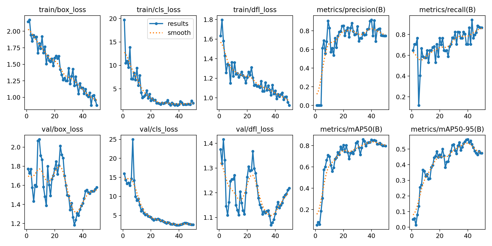

# AI-Powered Surface Inspection System 🏭🧠 (S7-1200 / S7-1500 & YOLOv8)

*(**Note:** This project serves as an industrial AI-to-PLC quality control bridge designed for high-speed automated defect detection on production lines, with built-in Siemens S7-1200/1500 integration.)*

[](https://www.python.org/)
[](https://github.com/ultralytics/ultralytics)
[](https://www.siemens.com/)
[](http://snap7.sourceforge.net/)

This project is an Artificial Intelligence (AI) based industrial quality inspection system that detects surface anomalies and defective products on manufacturing lines in real-time, communicating directly with Siemens PLCs (S7-1200 / S7-1500) via Ethernet using the Snap7 library.

---

## 🌟 Key Features

- **YOLOv8 Deep Learning Vision:** Real-time object and anomaly detection on industrial surfaces (MVTec Anomaly Detection dataset).
- **Direct Siemens S7 PLC Integration:** Direct Put/Get S7 protocol memory access (`DB_AI_Communication` - DB1) via `python-snap7` with automatic reconnection and state-change writing.
- **Safety Interlock & Latching Logic:** When a defect is detected, the PLC latches the fault (`Fault_Active = TRUE`) and immediately stops the conveyor/motor (`%Q0.0 = 0`, `%QW96 = 0V`). The motor will NOT automatically restart until an operator triggers a manual reset button or sends an `[R]` Restart command from the UI.
- **Defect Archiving & Traceability:** Automatically captures defect snapshots to the `defects/` folder and logs timestamp, defect type, and confidence score to `defects/defect_log.csv`.
- **Heads-Up Display (HUD / OSD):** Live FPS calculation, bounding box visualization, motor status, and PLC link diagnostics.
- **Experimental Module - Fabric Stitching Inspection:** 5-Class multi-defect fabric stitching inspection with analog motor speed control (%QW96 0-10V / 27648 reference).

---

## 🏛️ System Architecture

```
┌──────────────────────────────────────────────────────────────┐
│  [Industrial Camera / Video Stream / RTSP]                   │
│       │                                                      │
│       ▼                                                      │
│  [PC / Edge Python Server]  ──── S7 Protocol (Snap7) ────►  [PLC]│
│   YOLOv8 AI Inference                                S7-1200 │
│   Defect Snapshot & CSV Logger                       TIA V17 │
│       │                                                  │   │
│       ▼                                                  ▼   │
│  [Real-Time OSD / HUD]                           [Tower Lamp]│
│  Defect type + confidence + motor status         OK / FAULT  │
└──────────────────────────────────────────────────────────────┘
```

---

## 📁 Project Structure

```
AI-Powered-Surface-Inspection-System/
├── src/
│   ├── __init__.py
│   ├── ai_inspection.py             # Main Surface Defect Inspection (YOLOv8 + Snap7)
│   ├── ai_stitching_inspection.py   # 5-Class Fabric Stitching Inspection (Bonus module)
│   ├── prepare_mvtec.py             # MVTec AD to YOLO Bounding Box dataset converter
│   ├── prepare_stitchingnet.py      # StitchingNet dataset converter
│   ├── train_yolov8.py              # YOLOv8 fine-tuning pipeline
│   └── train_stitching_yolov8.py    # Stitching model training pipeline
├── plc/
│   ├── plc_surface_logic.scl        # TIA Portal SCL logic for surface inspection (DB1 + FB1)
│   ├── plc_stitching_logic.scl      # TIA Portal SCL logic with %QW96 analog output
│   └── dikis_motor/                 # TIA Portal V17 project archive (.ap17)
├── weights/
│   ├── best.pt                      # Fine-tuned MVTec Leather Defect weights
│   └── yolov8n.pt                   # Base YOLOv8 Nano fallback model
├── datasets/
│   ├── mvtec_leather_data.yaml      # MVTec Leather YOLO configuration
│   ├── stitchingnet_data.yaml       # Fabric Stitching YOLO configuration
│   └── stitchingnet/                # Sample raw dataset images
├── docs/
│   ├── User_Manual.md               # Hardware & TIA Portal configuration manual (TR)
│   └── AI-Powered-Surface-Inspection-System.md # Technical specification & proposal
├── requirements.txt                 # Python dependencies
└── README.md                        # Project documentation
```

---

## 🚀 Installation & Quick Start

### 1. Install Dependencies
```bash
pip install -r requirements.txt
```

### 2. Run Surface Inspection (Inference)

#### Mode A: With Physical Siemens S7 PLC Connected
```bash
python src/ai_inspection.py --ip 192.168.1.20 --conf 0.25
```

#### Mode B: Simulation / Test Mode (Without Physical PLC)
```bash
python src/ai_inspection.py --mock-plc --conf 0.25
```

#### CLI Parameters:
| Argument | Default | Description |
|----------|---------|-------------|
| `--source` | `0` | Camera device index (e.g. `0`, `1`) or video file path |
| `--weights` | Auto-detect | Path to custom trained `.pt` model weights |
| `--conf` | `0.25` | Confidence threshold for defect detection |
| `--ip` | `192.168.1.20` | Siemens PLC IP address |
| `--rack` | `0` | Siemens PLC Rack number |
| `--slot` | `1` | Siemens PLC Slot number (1 for S7-1200/1500) |
| `--db` | `1` | Data Block number in TIA Portal (`DB1`) |
| `--mock-plc` | `False` | Run in simulation mode without PLC connection |
| `--save-defects`| `True` | Automatically save defect snapshots & CSV log |

---

## ⌨️ Live Keyboard Controls

| Key | Action | Description |
|:---:|--------|-------------|
| `[Q]` | **Quit** | Exits the inspection program safely and closes connections. |
| `[R]` | **Restart Motor** | Sends restart command (`Restart_Cmd = 1`) to PLC to clear fault lock and resume line. |
| `[S]` | **Simulate Defect** | Triggers a simulated defect for quick functional and PLC interlock testing without physical defects. |

---

## 🧠 Dataset Preparation & Model Training

### 1. Prepare MVTec AD Dataset
1. Download any category (e.g. `leather`, `wood`, `metal_nut`) from the [MVTec AD Dataset](https://www.mvtec.com/company/research/datasets/mvtec-ad).
2. Extract the archive into the `mvtec_anomaly_detection/` folder (e.g. `mvtec_anomaly_detection/leather/train` and `test`).
3. Convert masks to normalized YOLO bounding boxes:
```bash
python src/prepare_mvtec.py --category leather
```

### 2. Train YOLOv8
```bash
python src/train_yolov8.py --data datasets/mvtec_leather_data.yaml --epochs 50 --batch 16
```
Trained weights are automatically saved to `runs/detect/mvtec_surface_inspection/weights/best.pt`.

---

## 📊 Training Results & Performance

- **Model:** YOLOv8 Nano (`yolov8n.pt`)
- **Dataset:** MVTec AD (`leather` category)
- **mAP50:** **79.7%**
- **mAP50-95:** **47.4%**

### Performance Curves


---

## ⚙️ Siemens PLC Memory Mapping (DB1)

The Python Snap7 client directly writes to and reads from `DB_AI_Communication` (DB1):

| Offset | Variable | Type | Description |
|:------:|----------|:----:|-------------|
| `0.0` | `AI_Result_Code` | `Int` | `0`: Idle, `1`: OK (Normal), `2`: NOK (Defect Found) |
| `2.0` | `Defect_Type` | `Int` | `0`: None, `1`: Surface Defect (or 1..5 for Stitching) |
| `4.0` | `Restart_Cmd` | `Int` | `0`: Idle, `1`: Pulse to clear fault latch |

> ⚠️ **Important TIA Portal Settings:**
> 1. Enable **"Permit access with PUT/GET communication from remote partner"** in CPU Properties.
> 2. Disable **"Optimized block access"** on `DB_AI_Communication` (must be non-optimized standard DB).
> 3. See [docs/User_Manual.md](docs/User_Manual.md) for full step-by-step setup instructions.

---

## 🧵 Experimental Module: Fabric Stitching Defect Inspection

For textile defect inspection, an experimental 5-class stitching quality module is included:

```bash
# Run Stitching Inspection
python src/ai_stitching_inspection.py --ip 192.168.1.20

# Run in Mock Simulation Mode
python src/ai_stitching_inspection.py --mock-plc
```

### Stitching Defect Classes:
- `1`: Atlamalı Dikiş (Skipped Stitch)
- `2`: Kopuk Dikiş (Broken Stitch)
- `3`: Eğri Dikiş (Crooked Seam)
- `4`: Gevşek İplik (Thread Sagging)
- `5`: İğne Hasarı (Needle Damage)

PLC logic for stitching control includes analog speed reference regulation (`%QW96` 0-10V / 27648) in [plc/plc_stitching_logic.scl](plc/plc_stitching_logic.scl).

---

## 📄 License & Credits
Developed for industrial automated vision inspection. Designed with modularity and Siemens automation compliance.
